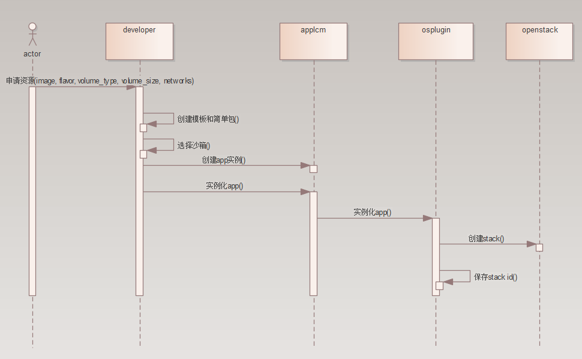
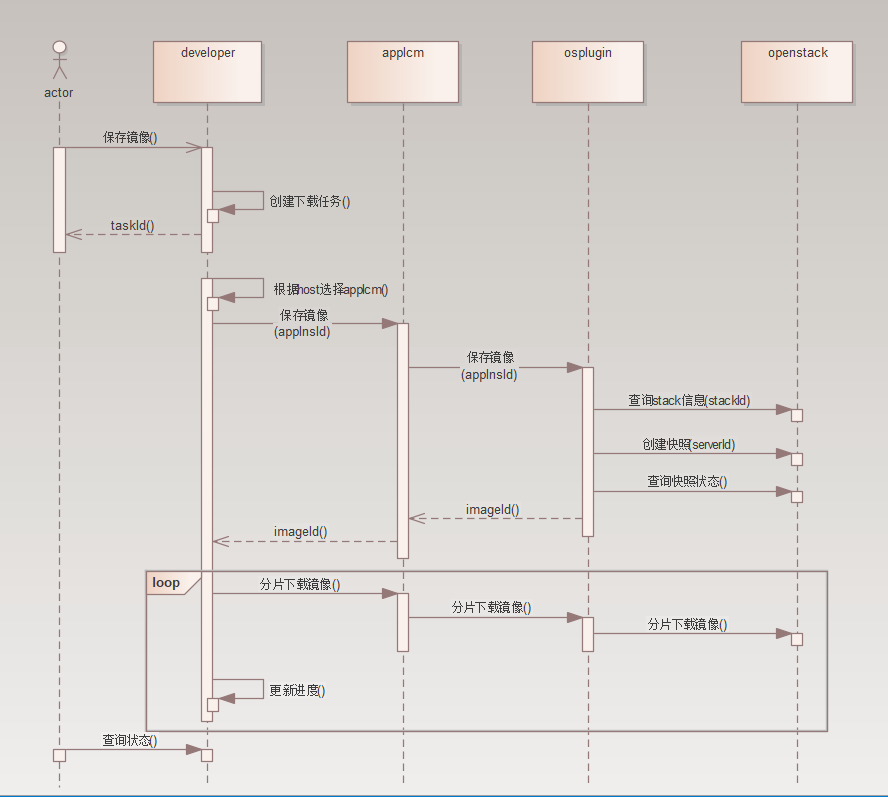

# 虚拟机部署需求

## 1. 需求描述

### 1.1. developer需求

+ 查询虚拟机基础镜像的能力
  
+ 查询虚拟机规格的能力

+ 查询虚拟机网络的能力

+ 设置虚拟机root密码的能力

+ 生成HOT模版的能力

+ 分配，管理边缘沙箱的能力

+ 申请虚拟机的能力

+ 远程登陆虚拟机的能力

+ 把文件上传到虚拟机的能力

+ 创建虚拟机镜像，记录创建进度

### 1.2. applcm需求

+ 通过简单包(如: 只包含HOT模版)启动虚拟机的能力
  
+ 管理虚拟机app生命周期的能力
  
+ 生成虚拟机快照的能力
  
+ 下载虚拟机快照的能力
  
+ 远程登陆虚拟机的能力

+ 把文件上传到虚拟机的能力

### 1.3. osplugin需求

+ 通过简单包(如: 只包含HOT模版)启动虚拟机的能力
  
+ 管理app生命周期的能力
  
+ 生成虚拟机快照的能力

+ 下载虚拟机快照的能力
  
+ 远程登陆虚拟机的能力

### 1.4. 其他需求

+ mecm需要维护openstack接入方式(如使用openrc)

+ mecm维护的openstack需要提供统一名称标准的image, flavor, network, volume_type

+ 远程的实现 (注: 3.2)

## 2. 关键业务流程

+ 申请虚拟机

选择规格、镜像 -> 选择网络 -> 配置虚拟机名称，密码 -> 生成简单包 -> 分配沙箱节点 -> 部署虚拟机

+ NoVNC登陆

申请NoVNC连接 -> 访问NoVNC连接

+ 镜像生成

创建虚拟机快照 -> 下载虚拟机快照 -> 记录进度

## 3. 功能实现

### 3.1. 申请虚拟机
虚拟机通过HOT模版创建stack，HOT设置虚拟机名称，镜像，规格，网络，存储卷，通过user-data初始化root密码，安装agent等。
HOT 模版范例:

```

heat_template_version: 2015-04-30
description: this is an example
resources:
  # setting vm
  vm1:
    type: OS::Nova::Server
    properties:
      name: myvm1
      flavor: 1c-1g
      config_drive: true
      block_device_mapping_v2:
      - delete_on_termination: true
        volume_id: { get_resource: sd1 }
      networks:
      - port: { get_resource: vl1 }
      - port: { get_resource: vl2 }
      - port: { get_resource: vl3 }
      admin_pass: xxxx
      # 可用区
      availability_zone: zone1
      # shell格式user data，还可以使用yaml格式的user data
      user_data: |
        #!/bin/bash
        passwd root<<EOF
        xxxx
        xxxx
        EOF
  # setting system disk
  sd1:
    type: OS::Cinder::Volume
    properties:
      image: centos_x86_7.6
      size: 20
      volume_type: default
  # setting virtual disk
  vd1:
    type: OS::Cinder::Volume
    properties:
      size: 100
      volume_type: default
  vd1_atta:
    type: OS::Cinder::VolumeAttachment
    properties:
      volume_id: { get_resource: vd1 }
      instance_uuid: { get_resource: vm1 }
  # setting virtual link
  vl1:
    type: OS::Neutron::Port
    properties:
      network: vlan_103
  vl2:
    type: OS::Neutron::Port
    properties:
      network: vlan_104
  vl3:
    type: OS::Neutron::Port
    properties:
      network: vlan_105
outputs:
  instance_ip:
    description: IP address of the deployed compute instance
    value: { get_attr: [vm1, addresses]}

```

直接销毁stack，来销毁虚拟机

### 3.2. 远程登陆

+ openstack自带NoVNC实现，但是要求访问者网络与openstack在同一网络内。可以通过搭建代理来解决

+ webssh，需要ssh服务，需要虚拟机网络正常

### 3.3. 生成虚拟机镜像

+ 使用openstack创建虚拟机快照功能(或备份功能)，然后把快照保存为qcow2格式。缺点是生成的镜像较大。

### 3.4. 虚拟机配置

#### root密码配置:

+ 可以使用nova-api提供的密码重置功能(需要nova-api配置开启)。

+ 可以使用cloud-init user-data配置(需要镜像有cloud-init)。

#### 文件上传

+ vsftp，通过ssh协议上传(需要vsftp，ssh服务)

+ zmodemjs + lrzsz，（zmodem协议，需要服务器安装lrzsz，终端往服务器发送rz命令上传，速度较慢，适合传输小文件)

+ 其他

## 4. openstack接口需求

| 方法 | 服务 | 路径 | 说明 |
| --- | --- | --- | --- |
| POST | orchestration | /v1/{tenant_id}/stacks | 创建stack |
| DELETE| orchestration | /v1/{tenant_id}/stacks/{stack_name}/{stack_id} | 销毁stack |
| GET | orchestration | /v1/{tenant_id}/stacks/{stack_name}/{stack_id}/resources | stack resource列表 |
| GET | compute | /servers/{server_id} | 获取虚拟机信息 |
| POST | compute | /servers/{server_id}/action | 操作虚拟机, 用于停止，创建快照 |
| POST | compute | /servers/{server_id}/remote-consoles | 控制台 |
| GET | image | /v2/images/{image_id}/file | 下载镜像 |

## 5. 接口设计

applcm https

| 方法 | 路径 | 说明 |
| --- | --- | --- |
| POST | /lcmcontroller/v1/tenants/{tenantId}/app_instances/{appInstanceId}/instantiate | 实例化app |
| POST | /lcmcontroller/v1/tenants/{tenantId}/app_instances/{appInstanceId}/terminate | 销毁app实例 |
| GET | /lcmcontroller/v1/tenants/{tenantId}/app_instances/{appInstanceId} | 获取app实例详情，包含console路径 |
| POST | /lcmcontroller/v1/tenants/{tenantId}/app_instances/{appInstanceId}/images | 保存镜像 |
| GET | /lcmcontroller/v1/tenants/{tenantId}/app_instances/{appInstanceId}/images/{imageId}/file | 分片下载 |

osplugin grpc

| 服务 | 操作 | 说明 |
| --- | --- | --- |
| AppLCM | instantiate | 实例化app |
| AppLCM | terminate | 销毁app |
| AppLCM | query | 查询APP信息 |
| SERVER | saveImage | 保存镜像 |
| SERVER | downloadImage | 下载镜像分片 |


## 6. osplugin 数据库设计

| 字段 | 名称 | 类型 | 可空 | 说明 |
| --- | --- | --- | --- | --- |
| app_ins_id | app实例ID | varchar(36) | 否 | 主键 |
| host_ip | openstack host ip | varchar(15) | 否 | openstack 标识 |
| stack_name | stack名称 | varchar(30) | 否 | openstack stack 名称 |
| stack_id | stack ID | varchar(36) | 否 | openstack stack id |

## 7. 系统流程

+ 虚拟机部署



+ 镜像生成

