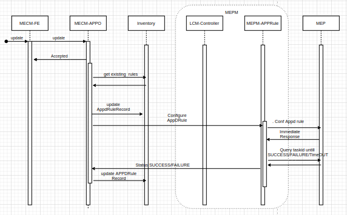

### 需求来源 （Requirement Source）

- EdgeGallery version plan to Enhance the Appliation Deployment/Termination.

### 需求描述 （Requirement Description）
- APP Instance Termination Enhancement, provide another new interface to MECM, to delete the app instance info and ak/sk and app rules info.

### Requirement Details
Currently we have Multiple MM5 interface delete the app instance and its relation configuration. So inorder to simplify the termination process, provide a single interface and handle below processing with in MEP
- Delete AK/SK of this Application.
- Unregister this application and its services from Service Comb.
- Delete all the configures DNS Rules and Traffic Rules if any.

### Modules && EPIC && Story
- I2DQV5 [MEP] APP Instance Termination Enhancement

### 业务流程
#### 1. Current End to End Flow for Application Termination

#### 2. Current End to End Flow for Application DNS, Traffic rule Deletion

#### 3. New Flow for Application termination

### 接口定义 (Interface Definition)

| Module | Interface | Detials  |  Parameter |
|--------|-----------|-----------|--------|
| mep-server | Mm5 | /mep/mec_app_support/v1/applications/:appInstanceId/AppInstanceTermination | appInstanceId - Applicaition Instance Identifier. |

### 工作量评估 Estimate effort
0.5K Loc

### 技术选型 Selection
None
