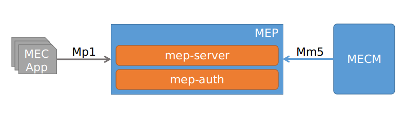

### 需求来源 （Requirement Source）

- EdgeGallery version plan

### 需求描述 （Requirement Description）
- Change mep-server root path to "/mep" from "/mepserver" on Mp1 interface.
- Change the mep-auth token path root from "/mepauth/v1" to "/mep".
- Change the mep-auth routes path root from "/mepauth/v1" to "/mep/appMng/v1".
- Change the mep-auth applications path root from "/mepauth/v1" to "/mep/appMng/v1".

### Usecase
The root path of the API's for Mp1/Mm5 interface is different in mepserver and mep-auth modules, which can be unified into a single root for better management of the interfaces.

### Modules && EPIC && Story
- Mep root path unification

### 业务流程

### 接口定义 (Interface Definition)

| Module | Interface | Old-Path  | New-Path | Impact |
|--------|-----------|-----------|----------|--------|
| mep-server | Mp1 | /mepserver/mec_service_mgmt/v1/applications/... | /mep/mec_service_mgmt/v1/applications/... | If any application using this API on Mp1 needs change. But, no applications are using it yet, hence safe to change it. |
| mep-server | Mp1 | /mepserver/mec_app_support/v1/applications/...  | /mep/mec_app_support/v1/applications/...  | If any application using this API on Mp1 needs change. But, no applications are using it yet, hence safe to change it. |
| mep-auth | Mp1 | /mepauth/v1/token | /mep/token | If any application using this API on Mp1 needs change. But, no applications are using it yet, hence safe to change it. |
| mep-auth | Mm5 | /mepauth/v1/routes/:routeId | /mep/appMng/v1/routes/:routeId | MECM needs update to accommodate this change |
| mep-auth | Mm5 | /mepauth/v1/applications/:applicationId/confs | /mep/appMng/v1/applications/:applicationId/confs | MECM needs update to accommodate this change |

### MEP-Agent Changes
- All Mp1 and token apis used by the mep-agent need to be changed.
- Token signing is using the api url, whcih need to be updated according to the new changes. 

### 工作量评估 Estimate effort
0.3K Loc

### 技术选型 Selection
None