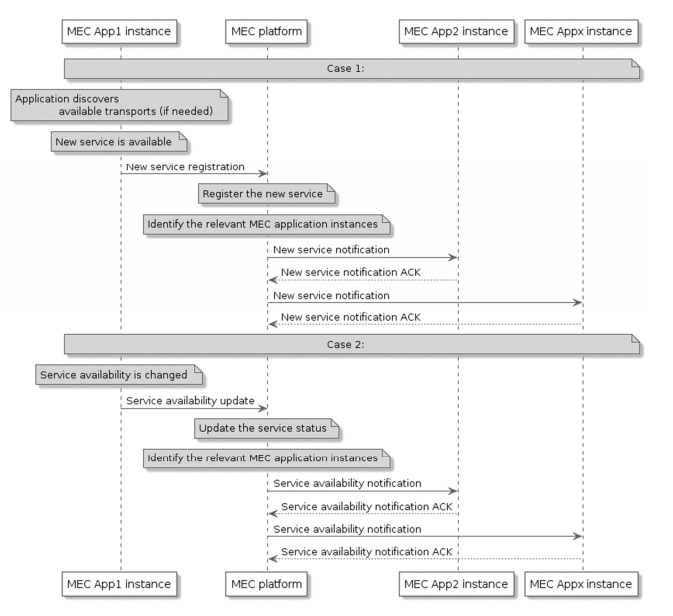
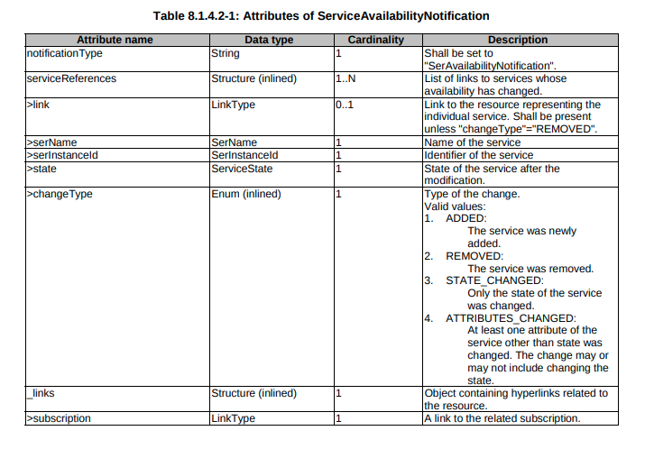

### Source of Requirement
- EdgeGallery version 1.1
- ETSI MEC 011

### Requirement Description
- Support service availability notiication to the subscribed app

### Usecase

- MEC service availibility notification

1. After a new MEC service becomes available, MEC platform identifies the relevant MEC application instance for this update and sends new service notifications to the relevant application instances.
 The MEC application instances, optionally, acknowledge the notification 
 2. When a MEC service changes its availability,  (Either via heartbeat not received or service become unavailable) MEC platform identifies the relevant MEC application instance for this update and sends new service notifications to the relevant application instances.
 The MEC application instances, optionally, acknowledge the notification

###  EPIC && Story

- MEP 
    - mepserver add notification mechanism, i.e. send service availibility notification to the subscribed app. It'll call the url provided by the subscriber application.

### Proposed Changes

### Interface definition
#### 1. (MEP -> APP)
The subscription mechanism is already developed.
Reference: https://forge.etsi.org/rep/mec/gs011-app-enablement-api/raw/master/MecServiceMgmtApi.yaml
The notificaion mechanism to be developed.

#### MEP Server changes:

1. Notification mechanism to be added to send service availibility notification to subscribed app

####  Security Design applicability:
1. No seperate Security to be considered for this Feature other than Log security.
2. Support http/https notification to APP

### Estimate effort
1.5K Loc (including dev and unit test)